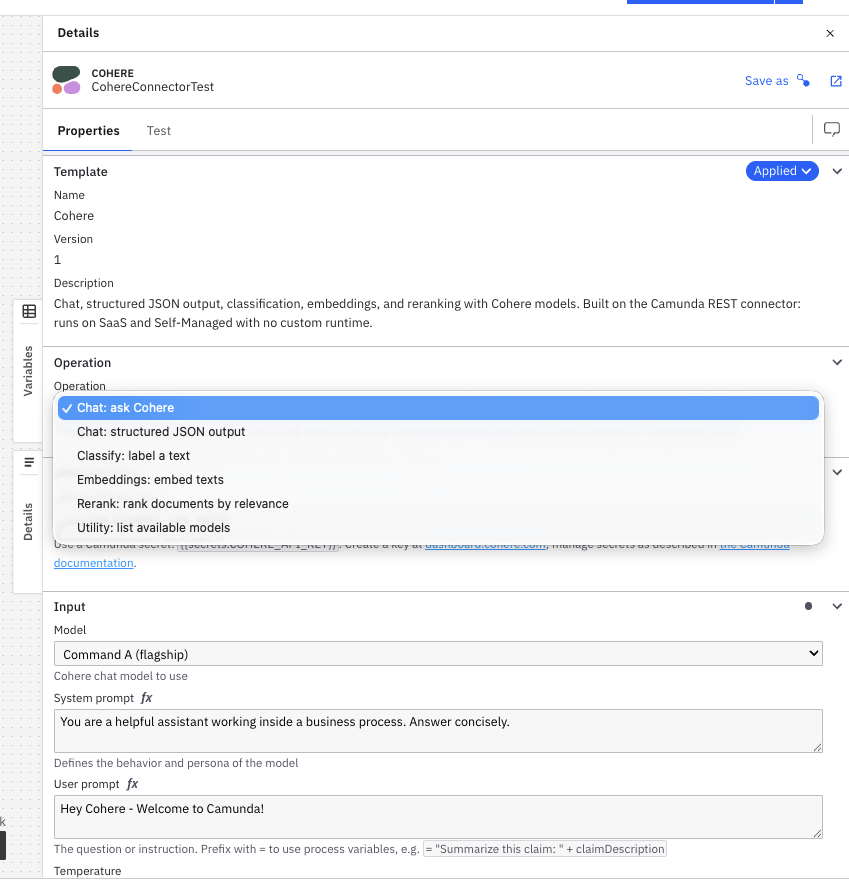

# Cohere Connector for Camunda 8

Bring [Cohere](https://cohere.com) models into your BPMN processes: chat, structured JSON
output, text classification, embeddings, and reranking, straight from a service task.


Created by Zishan Ali Khan (Camunda). Community connector, not an official Cohere product.



## Features

- **6 operations** covering the Cohere platform: chat, schema-guaranteed JSON answers,
  classification, embeddings, reranking, and model discovery
- **Rerank support**: feed vector-store hits to Cohere Rerank and get relevance-ordered
  documents, the missing middle step of most RAG processes
- **Zero hosting**: an element template on Camunda's native REST connector
  (`io.camunda:http-json:1`), so there is no custom runtime and no Java, and it runs
  anywhere the built-in connectors run
- **Token usage surfaced**: chat operations map Cohere's billed token counts into a process
  variable for cost tracking
- **Current model lineup** in every dropdown, plus a custom-model field for fine-tuned or
  newly released models
- **API key via Camunda secrets** (`{{secrets.COHERE_API_KEY}}`), never stored in the model

## Sample process

[`example/customer-feedback-triage.bpmn`](example/customer-feedback-triage.bpmn) is a
ready-to-open showcase with the template applied to every task: classify incoming feedback,
route on the label, answer questions with a rerank-grounded reply (a miniature RAG), and
turn complaints into structured JSON for a human queue.

```
                                       question --> [Find relevant help articles] --> [Draft grounded answer] --\
Feedback --> [Classify feedback] --> <?> -- complaint --> [Extract severity and summary] ------------------------+--> End
                                       praise -----------------------------------------------------------------/
```

Both branches are verified on a live Camunda 8.9 SaaS cluster. A real run, verbatim:

- In: *"The export button has said 'loading' since Tuesday. My coffee has gone cold twice
  waiting for it, and cold coffee is a severity of its own."*
- `cohereLabel`: `"complaint"`, and `complaintJson`:

```json
{
  "severity": "high",
  "summary": "The export button has been stuck on 'loading' for several days, causing significant delays and frustration, resulting in cold coffee twice."
}
```

To try it: upload the `.bpmn` to Web Modeler (with the template installed the tasks render
with the Cohere icon and full template panel), create the `COHERE_API_KEY` secret, deploy,
and start an instance with a `customerMessage` variable.
`example/run-triage-sample.cjs` automates deploy-run-verify for both branches.

There is also [`example/cohere-connector-smoke.bpmn`](example/cohere-connector-smoke.bpmn),
a minimal three-task test rig (chat, classify, rerank in a straight line) with
`example/run-cluster-smoke.cjs` as its runner. Both runners need `@camunda8/sdk` and Zeebe
API client credentials in a `.env`.

## Installation

Download [`src/cohere-connector.json`](src/cohere-connector.json), then:

**Web Modeler:** upload the file to your project, or publish it to your organization so
every project sees it. See
[managing element templates](https://docs.camunda.io/docs/components/modeler/web-modeler/element-templates/manage-element-templates/).

**Desktop Modeler:** copy the file into the element templates folder and restart:

| OS | Folder |
| --- | --- |
| Windows | `%APPDATA%\camunda-modeler\resources\element-templates` |
| macOS | `~/Library/Application Support/camunda-modeler/resources/element-templates` |
| Linux | `~/.config/camunda-modeler/resources/element-templates` |

(Or put it in `resources/element-templates` next to your `.bpmn` files for a per-project
setup. Details in
[configuring templates](https://docs.camunda.io/docs/components/modeler/desktop-modeler/element-templates/configuring-templates/).)

## Setup

1. Create an API key at [dashboard.cohere.com/api-keys](https://dashboard.cohere.com/api-keys)
   (a free trial key works for evaluation).
2. Store it as a [Camunda secret](https://docs.camunda.io/docs/components/console/manage-clusters/manage-secrets/)
   named `COHERE_API_KEY`. New SaaS secrets can take a few minutes to reach the connector
   runtime.
3. Create a service task, apply the **Cohere** template, pick an operation, done.

## API coverage

| Operation | Method + endpoint | Cohere reference |
| --- | --- | --- |
| Chat: ask Cohere | `POST /v2/chat` | [Chat](https://docs.cohere.com/reference/chat) |
| Chat: structured JSON output | `POST /v2/chat` + `response_format` | [Structured outputs](https://docs.cohere.com/docs/structured-outputs) |
| Classify: label a text | `POST /v2/chat` (temperature 0, schema-enforced label enum) | [Structured outputs](https://docs.cohere.com/docs/structured-outputs) |
| Embeddings: embed texts | `POST /v2/embed` | [Embed](https://docs.cohere.com/reference/embed) |
| Rerank: rank documents by relevance | `POST /v2/rerank` | [Rerank](https://docs.cohere.com/reference/rerank) |
| Utility: list available models | `GET /v1/models` | [Models](https://docs.cohere.com/reference/list-models) |

The exact request body of each operation is visible and editable under *Endpoint
(technical)* in the properties panel; result mappings live under *Output mapping*. Both
are plain FEEL, adjust them freely.

## Output mapping recipes

**Route on a classification.** Classify with labels `=["approve", "review", "reject"]`,
then gate on the result:

```feel
=cohereLabel = "approve"
```

**Rerank, then rebuild the ordered document list.** `position` is 1-based, so it indexes
FEEL lists directly. Add an output mapping on the rerank task:

```feel
=for r in cohereRanked return rerankDocuments[r.position]
```

**Force schema-conformant JSON.** Give the structured output operation a schema:

```feel
={"type": "object", "properties": {"riskLevel": {"type": "string"}}, "required": ["riskLevel"]}
```

`cohereJson` is then a string guaranteed to parse as JSON matching the schema. If you skip
the schema, mention the word JSON in your prompt (Cohere requires it for free-form JSON mode).

**Turn rate limits into BPMN errors.** Error expressions run after every invocation,
including successes, so keep them conditional:

```feel
=if error != null and error.code = "429" then bpmnError("COHERE_RATE_LIMIT", "Cohere rate limit hit") else null
```

## Track token spend

Chat operations map Cohere's billed units into `cohereUsage`
(`{"input_tokens": ..., "output_tokens": ...}`) on every instance. Because it is a plain
process variable you can aggregate it in Camunda Optimize variable reports, or read it in
Operate when a single instance needs explaining. Embeddings expose
`cohereEmbedBilledTokens` the same way.

## Supported models

| Model | Good for |
| --- | --- |
| Command A+ | Flagship with vision and reasoning |
| Command A | Flagship text generation and tool use |
| Command A Reasoning | Harder multi-step reasoning tasks |
| Command R+ / Command R | Strong generalists, lower cost |
| Command R7B | Fast, cheap; classification and short answers |
| Aya Expanse 32B | Multilingual (23 languages) |
| Embed v4 | Embeddings, 1536 dimensions |
| Rerank v4 Pro / Fast, Rerank v3.5 | Relevance reranking |

Every dropdown also offers **Custom model (enter below)** for fine-tuned models or models
released after this template; the *list available models* operation shows what your key can
access.

## Known limitations

- **`cohereJson` is a string.** FEEL has no JSON-parse function, so the structured output
  arrives as a guaranteed-valid JSON string; parse it downstream (job worker, script task,
  or AI agent step).
- **Classification runs through chat.** Cohere retired the dedicated `/v1/classify`
  endpoint in September 2025, so the classify operation uses chat at temperature 0 with the
  label enforced through a structured-output enum: the model must pick from your list and
  cannot answer the text instead of labeling it.
- **Numeric fields are plain text.** Temperature, max tokens, and top N are converted with
  `number(...)` inside the body expression; keep them as plain text values.
- **Trial keys are rate-limited** (about 20 requests/minute, 1,000 calls/month). The
  template defaults to a `PT10S` retry backoff to stay friendly with that.
- **No streaming.** The REST connector waits for the full response; for long generations,
  raise the read timeout (default 120 s).

## Changelog

- **v3**: classify hardened with a schema-enforced label enum (a plain instruction let
  small models answer question-shaped texts instead of labeling them); customer feedback
  triage sample process
- **v2**: placeholders on all free-text fields, per-operation links to Cohere docs,
  Web Modeler screenshots
- **v1**: initial release with 6 operations, verified against a live Camunda 8.9 SaaS
  cluster

## License

[MIT](LICENSE). Cohere is a trademark of Cohere Inc.; this is a community connector, not an
official Cohere product.
